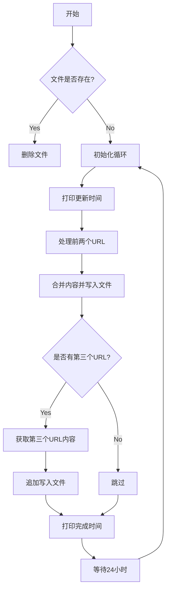

这段代码的功能是定期从指定的GitHub仓库中获取内容，并将结果保存到本地文件中。具体功能如下：

1. **配置信息**：定义了目标文件名`节点.txt`、HTTP请求头`HEADERS`以及需要爬取的三个GitHub仓库信息`REPOS`。
2. **函数实现**：
   - `get_html_content(url)`：从HTML页面中提取所有`<code>`标签的内容。
   - `get_raw_content(url)`：直接获取URL的原始文本内容。
   - `save_content(content, mode='w')`：将内容保存到文件中，支持覆盖写入（`w`）和追加写入（`a`）。
3. **主逻辑`main()`**：
   - 每次运行前清空目标文件。
   - 定期从`REPOS`中的前两个仓库获取内容并覆盖写入文件。
   - 如果存在第三个仓库，则获取其内容并追加写入文件。
   - 每隔24小时重复上述操作。

# 控制流图

这段代码的用法如下：

1. **配置目标文件**：代码会将爬取的内容保存到`节点.txt`文件中，该文件路径为当前脚本运行目录下的`节点.txt`。
2. **设置请求头**：通过`HEADERS`变量设置了HTTP请求头，模拟浏览器访问，避免被目标网站屏蔽。
3. **定义仓库信息**：在`REPOS`列表中定义了三个GitHub仓库的信息：
   - 第一个仓库从README页面中提取`<code>`标签内容。
   - 第二个和第三个仓库直接获取其原始文本内容。
4. **运行脚本**：
   - 确保安装了依赖库`requests`和`beautifulsoup4`，可以通过以下命令安装：
     ```bash
     pip install requests beautifulsoup4
     ```

   - 运行脚本：
     ```bash
     python "Real-time crawling nodes.py"
     ```

   - 脚本启动后会清空`节点.txt`文件，并开始定期从指定的GitHub仓库中获取内容，每隔24小时更新一次。

### 注意事项
- 确保网络连接正常，能够访问GitHub。
- 如果目标仓库的URL或结构发生变化，可能需要调整`REPOS`列表中的配置或`get_html_content`函数的解析逻辑。
- 脚本会无限循环运行，可通过终止进程（如按Ctrl+C）来停止脚本。

