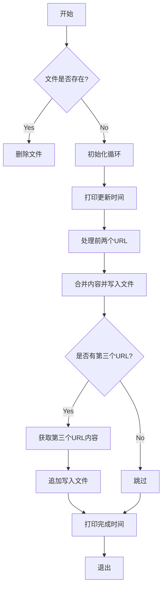

这exe的功能是点击从指定的GitHub仓库中获取内容，并将结果保存到本地文件中。具体功能如下：

1. **配置信息**：定义了目标文件名`节点.txt`、HTTP请求头`HEADERS`以及需要爬取的三个GitHub仓库信息`REPOS`。
2. **函数实现**：
   - `get_html_content(url)`：从HTML页面中提取所有`<code>`标签的内容。
   - `get_raw_content(url)`：直接获取URL的原始文本内容。
   - `save_content(content, mode='w')`：将内容保存到文件中，支持覆盖写入（`w`）和追加写入（`a`）。
3. **主逻辑`main()`**：
   - 每次运行前清空目标文件。
   - 定期从`REPOS`中的前两个仓库获取内容并覆盖写入文件。
   - 如果存在第三个仓库，则获取其内容并追加写入文件。

# 控制流图

这段代码的用法如下：

1. **配置目标文件**：代码会将爬取的内容保存到`节点.txt`文件中，该文件路径为当前脚本运行目录下的`节点.txt`。
2. **设置请求头**：通过`HEADERS`变量设置了HTTP请求头，模拟浏览器访问，避免被目标网站屏蔽。
3. **定义仓库信息**：在`REPOS`列表中定义了三个GitHub仓库的信息：
   - 第一个仓库从README页面中提取`<code>`标签内容。
   - 第二个和第三个仓库直接获取其原始文本内容。
在 Windows 系统中，若要让 Python 脚本 **后台运行** 并 **退出 CMD 界面**，有以下几种方法：

---

### 方法 1：使用 `pythonw.exe` 运行脚本（无黑窗）
#### 操作步骤：
1. **直接运行**：
   ```cmd
   pythonw.exe your_script.py
   ```
   - 使用 `pythonw.exe` 替代 `python.exe`，它会静默运行（不显示 CMD 窗口）
   - 脚本会在后台持续运行（通过 `while True` 循环）

2. **关闭脚本**：
   - 打开任务管理器 -> 找到 `pythonw.exe` 进程 -> 结束任务

---

### 方法 2：将脚本转为后台服务
#### 操作步骤：
1. **安装依赖库**：
   ```cmd
   pip install pywin32
   ```

2. **编写服务代码**（保存为 `service_script.py`）：
   ```python
   import win32serviceutil
   import win32service
   import win32event
   import servicemanager
   import sys
   import time

   class MyService(win32serviceutil.ServiceFramework):
       _svc_name_ = "NodeUpdaterService"
       _svc_display_name_ = "节点自动更新服务"

       def __init__(self, args):
           win32serviceutil.ServiceFramework.__init__(self, args)
           self.hWaitStop = win32event.CreateEvent(None, 0, 0, None)

       def SvcStop(self):
           self.ReportServiceStatus(win32service.SERVICE_STOP_PENDING)
           win32event.SetEvent(self.hWaitStop)

       def SvcDoExecute(self):
           # 在此处调用你的 main() 函数
           while True:
               # 你的原有逻辑
               time.sleep(3600)

   if __name__ == '__main__':
       if len(sys.argv) == 1:
           servicemanager.Initialize()
           servicemanager.PrepareToHostSingle(MyService)
           servicemanager.StartServiceCtrlDispatcher()
       else:
           win32serviceutil.HandleCommandLine(MyService)
   ```

3. **安装服务**：
   ```cmd
   python service_script.py install
   ```

4. **启动服务**：
   ```cmd
   python service_script.py start
   ```

5. **关闭服务**：
   ```cmd
   python service_script.py stop
   ```

---

### 方法 3：打包为后台 EXE 文件（推荐小白用户）
#### 操作步骤：
1. **安装 PyInstaller**：
   ```cmd
   pip install pyinstaller
   ```

2. **打包为无窗口 EXE**：
   ```cmd
   pyinstaller --noconsole --onefile your_script.py
   ```

3. **运行 EXE**：
   - 双击生成的 `your_script.exe`（无黑窗，后台运行）
   - 关闭方法：通过任务管理器结束进程

---

### 方法 4：使用 VBScript 启动后台进程
#### 操作步骤：
1. 创建一个 `run.vbs` 文件，内容如下：
   ```vbscript
   Set WshShell = CreateObject("WScript.Shell")
   WshShell.Run "pythonw.exe your_script.py", 0
   ```

2. 双击运行 `run.vbs`，脚本会在后台静默运行

---

### 方法 5：通过计划任务定时运行（不保持常驻）
如果不需要脚本持续运行，而是希望每小时自动触发一次：
1. 打开「任务计划程序」
2. 创建一个新任务：
   - 触发器：每小时重复一次
   - 操作：启动程序 `python.exe your_script.py`
   - 勾选「不管用户是否登录都要运行」

---

### 效果对比表
| 方法         | 是否需要窗口 | 是否需要安装依赖 | 适合场景               |
|--------------|--------------|------------------|------------------------|
| `pythonw.exe`| 否           | 否               | 快速临时使用           |
| 打包为 EXE   | 否           | 需 PyInstaller   | 长期使用/分发他人      |
| 系统服务     | 否           | 需 pywin32       | 专业后台服务           |
| VBScript     | 否           | 否               | 简单后台启动           |
| 计划任务     | 否           | 否               | 精准定时触发（非常驻） |

选择最适合你的方案即可！
